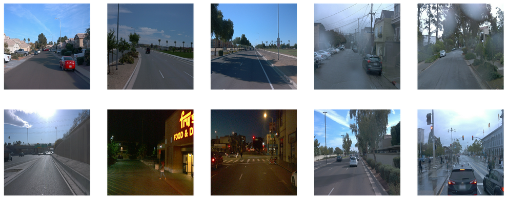
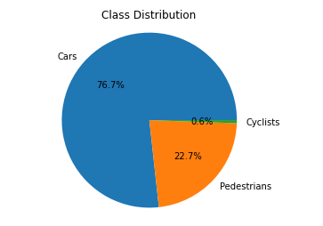
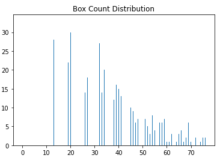
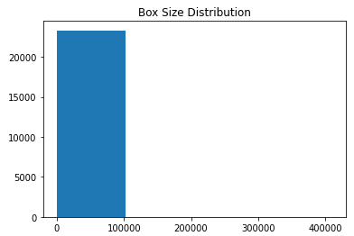
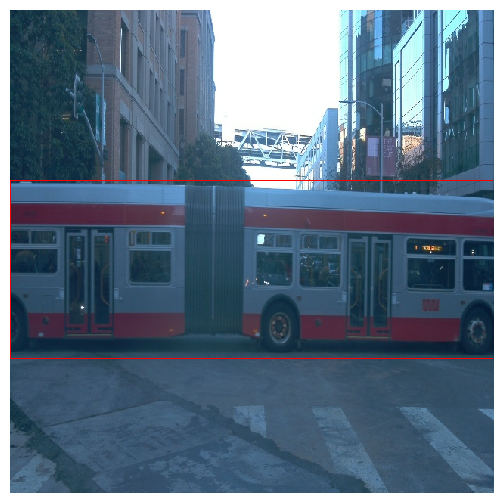
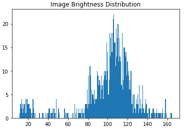
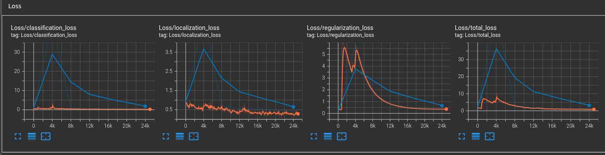
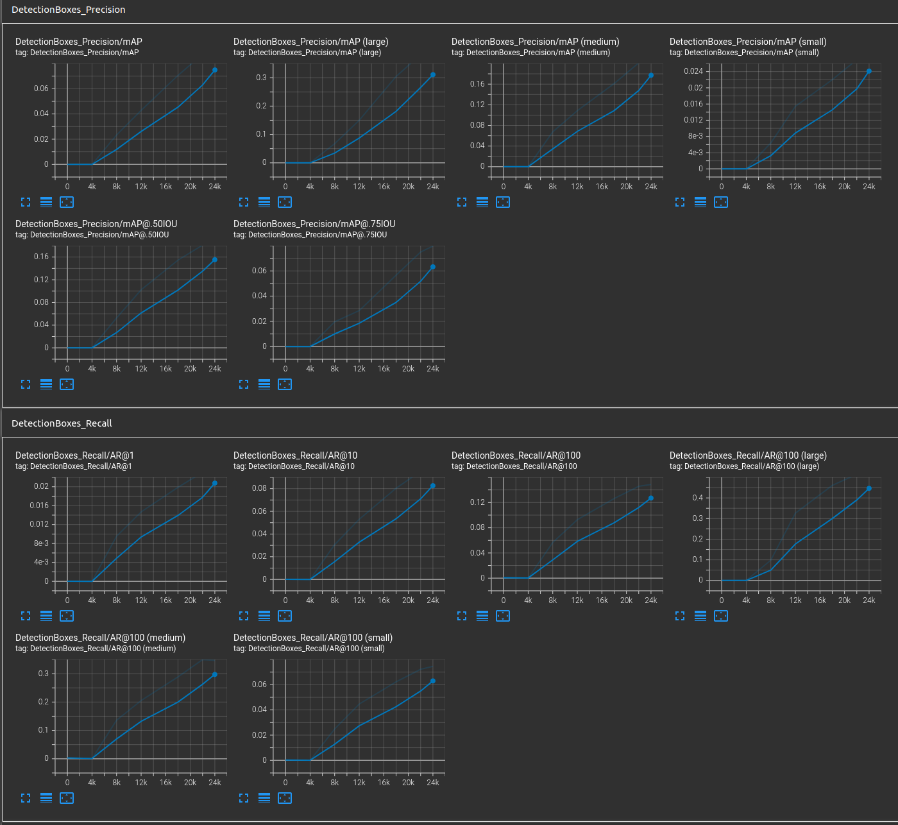
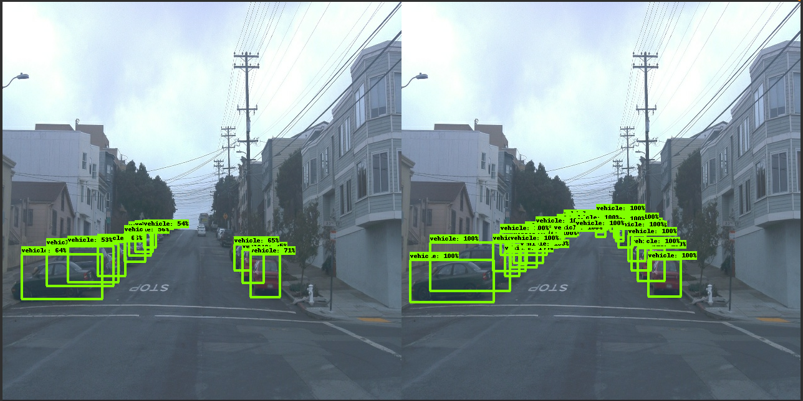

# Project overview

In this project, we will be exploring the construction of an object detection model for the Waymo Open Dataset.
In this exploration, we will analyze the dataset, choose training, validation, and test splits, and build and train a model.
Along the way, we will assess the contents of the dataset, choose augmentations to the dataset to help improve model performance, and make improvements to an existing model.
All of this is to enable a deeper understanding of object detection as a key aspect of self-driving car systems.
Object detection is the primary mechanism for a self-driving car system to perceive the other actors in the environment and to navigate that environment without causing harm.

# Dataset

## Dataset analysis

From a random sampling of the images included in the dataset, we can see that there are scenes taking place in urban and suburban locations, in night and day, and with varying weather.

The dataset also includes a set of groundtruth classes. From the graph below, we can see that the objects classified in the dataset are mostly cars, with some pedestrians, and relatively few bicyclists.

Furthermore, we can see that most images in the dataset contain between 10-30 labelled bounding boxes, with a smaller proportion containing more, up to more than 70 in a small number of instances.

Looking at the distribution of the sizes of these boxes, we can see that most of them are smaller, but there are some boxes that consume nearly the entire image.

An example of this type of large box might be a bus passing in front of the camera.

Finally, as we saw from the random sampling, the dataset includes scenes from different times of day. The distribution below helps to show that most images are from relatively bright daytime scenes, but that there is also a smaller cluster of scenes taking place in dark conditions, likely nighttime scenes.

## Cross validation

The splits chosen for the dataset are 75% training, 15% validation, and 10% testing.
Splitting the data in this way gives us a substantial corpus to train and subsequently validate from.
Keeping 10% set aside for testing should ensure we detect if the model has overfit to the training/validation dataset.

# Training

## Reference experiment

We ran the reference experiment to establish a baseline performance for object detection.
Looking at the loss metrics, we can see that the loss values for classification and localization are falling toward zero, reaching 0.2378 and 0.2722 respectively after 25k steps.
Additionally, we can see the validation loss is converging towards those same values, with classification at 0.3708 and localization at 0.4434 after 24k steps.

At the same time, we can see both mean average precision and average recall are increasing.\
The final result for mAP after 24k steps is 0.09193.
For AR@100 after 24k steps, we see 0.1485.

Ultimately, we've been able to achieve reasonable, if not great, results from training this model.
Next, we will make some modifications to the reference to try to improve its performance.

## Improve on the reference

This section should highlight the different strategies you adopted to improve your model. It should contain relevant figures and details of your findings.
