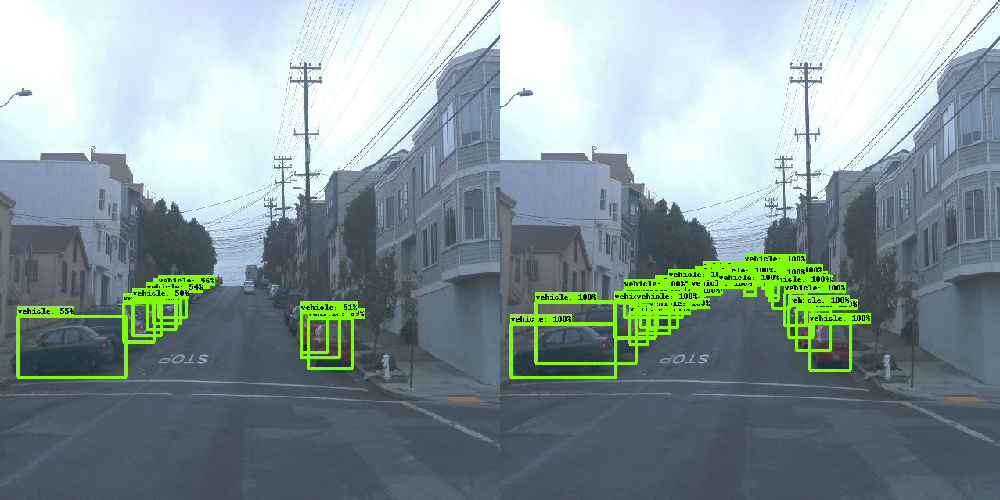

# Project overview

In this project, we will be exploring the construction of an object detection model for the Waymo Open Dataset.
In this exploration, we will analyze the dataset, choose training, validation, and test splits, and build and train a model.
Along the way, we will assess the contents of the dataset, choose augmentations to the dataset to help improve model performance, and make improvements to an existing model.
All of this is to enable a deeper understanding of object detection as a key aspect of self-driving car systems.
Object detection is the primary mechanism for a self-driving car system to perceive the other actors in the environment and to navigate that environment without causing harm.

# Dataset

## Dataset analysis

From a random sampling of the images included in the dataset, we can see that there are scenes taking place in urban and suburban locations, in night and day, and with varying weather.

The dataset also includes a set of groundtruth classes. From the graph below, we can see that the objects classified in the dataset are mostly cars, with some pedestrians, and relatively few bicyclists.

Furthermore, we can see that most images in the dataset contain between 10-30 labelled bounding boxes, with a smaller proportion containing more, up to more than 70 in a small number of instances.

Looking at the distribution of the sizes of these boxes, we can see that most of them are smaller, but there are some boxes that consume nearly the entire image.

An example of this type of large box might be a bus passing in front of the camera.

Finally, as we saw from the random sampling, the dataset includes scenes from different times of day. The distribution below helps to show that most images are from relatively bright daytime scenes, but that there is also a smaller cluster of scenes taking place in dark conditions, likely nighttime scenes.

## Cross validation

The splits chosen for the dataset are 75% training, 15% validation, and 10% testing.
Splitting the data in this way gives us a substantial corpus to train and subsequently validate from.
Keeping 10% set aside for testing should ensure we detect if the model has overfit to the training/validation dataset.

# Training

## Reference experiment

We ran the reference experiment to establish a baseline performance for object detection.
Looking at the loss metrics, we can see that the loss values for classification and localization are falling toward zero, reaching 0.2378 and 0.2722 respectively after 25k steps.
Additionally, we can see the validation loss is converging towards those same values, with classification at 0.3708 and localization at 0.4434 after 24k steps.

At the same time, we can see both mean average precision and average recall are increasing.\
The final result for mAP after 24k steps is 0.09193.
For AR@100 after 24k steps, we see 0.1485.

Ultimately, we've been able to achieve reasonable, if not great, results from training this model.
Next, we will make some modifications to the reference to try to improve its performance.

## Improve on the reference

### Experiment 1

In the [first experiment](./experiments/pipelines/experiment-1.config), we made changes to the data augmentation pre-processing of images.
Specifically, the images were randomly converted to grayscale and had their brightness, contrast, and saturation adjusted.
The hope here would be that we could produce a set of input images that simulated covering more lighting conditions than the actual dataset does.

Additionally, we've modified the activation function to use SWISH as it is regarded as performing better on deep networks.

After training and validation, we reviewed our results to find that these modifications did not outperform the reference. Instead, we see slightly worse results.
We see classification loss reaching only 0.2708 and localization loss at 0.2691 after 25k steps.
The validation losses also appear to be converging towards the training losses, which should mean that we are avoiding overfitting.

Still, we can see that our validation metrics are slightly worse for this experiment.
The final result for mAP after 24k steps is 0.07924.
For AR@100 after 24k steps, we see 0.1331.

Visually, we can see that this experiment doesn't seem to be more confident about the predictions it is making.

### Experiment 2

In this [second experiment](./experiments/pipelines/experiment-2.config), we made different choices for the data augmentation pre-processing of input images.
Specifically, we've chosen to switch to randomly cropping the image within the same aspect ratio as the original.
The hope with this change is to simulate zoom such that the model performs better identifying smaller objects.
We are also randomly converting images to grayscale and adjusting their brightness, but the delta for brightness has been increased to produce a more drastic darkening/lightening effect.
Finally, we've also introduced a random downsampling of quality for the image with the hopes to simulate blur or other types of weather effects like fog.

In this experiment, we've also switched the activation function to SWISH.
Additionally, we've raised the score threshold for NMS to 0.2 which should hopefully drop more of the very low confidence boxes.

Finally, we've tweaked some of the parameters for our loss functions.
We've reduced the delta on the weighted smooth L1 localization loss to induce loss values that should push the model to predict boxes closer to the groundtruth values.
We've also increased the gamma and reduced the alpha of the weighted sigmoid focal classification loss to induce the model to focus more on hard examples in the dataset.

With these modifications, we see a more improved result.
We see classification loss reaching 0.1092 after 25k steps and localization loss reaches 0.214.
Both of these results are significant improvements over the reference.

We can also see the our validation metrics are improved over the reference.
The final result for mAP after 24k steps is 0.1099.
For AR@100 after 24k steps, we see 0.1659.

Inspecting the validation images output to TensorBoard, we can see a slight improvement in the confidences of our predictions.

# Results

The exported model does a reasonably good job with the reserved test data as can be seen in the following animations.

